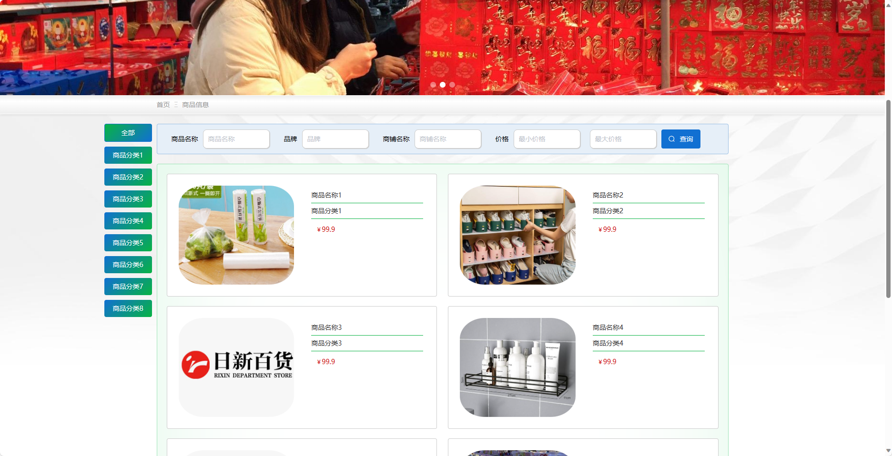
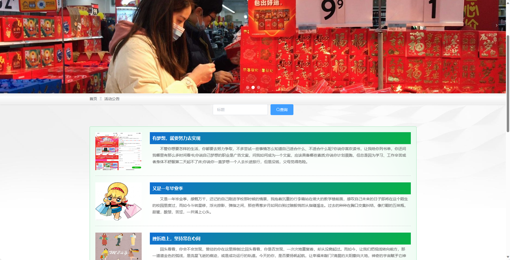
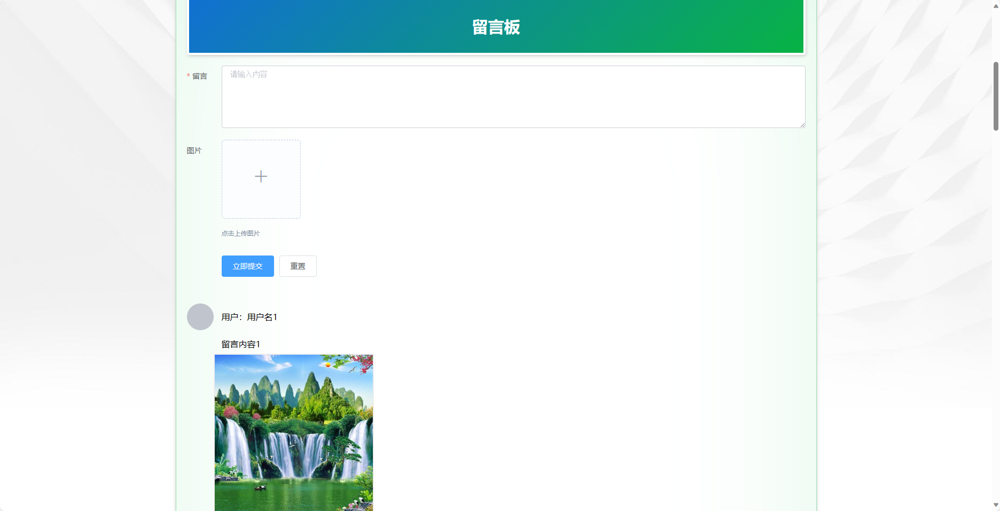
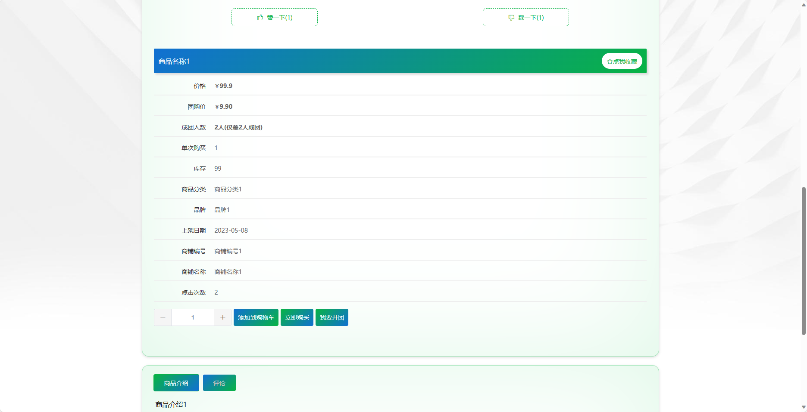
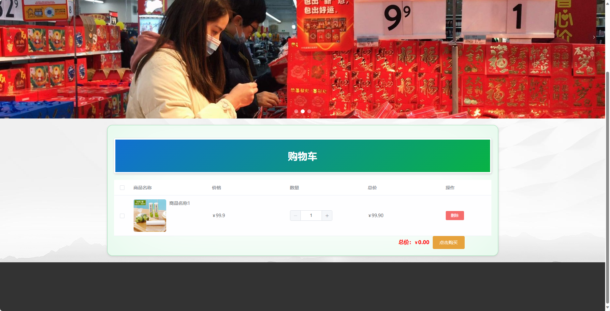
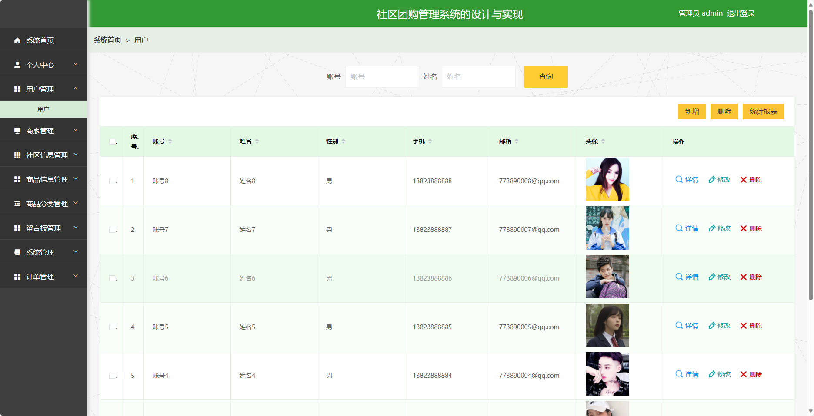
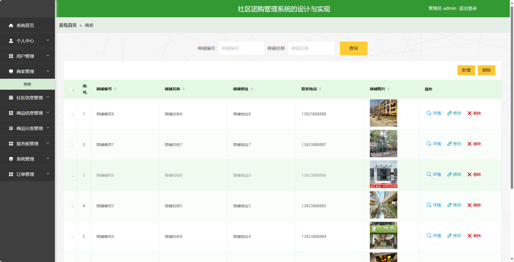
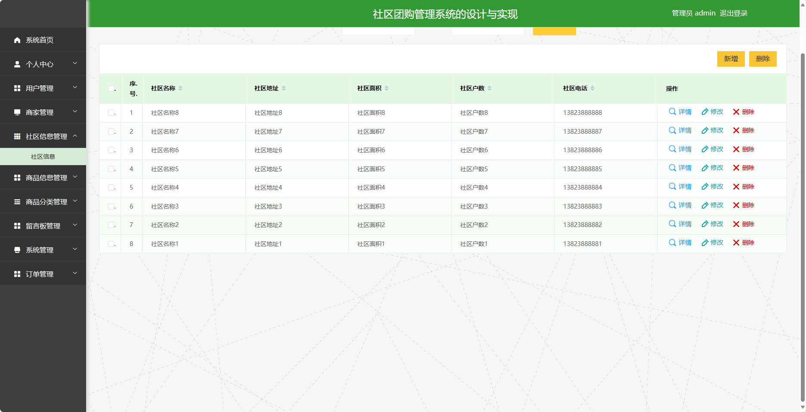
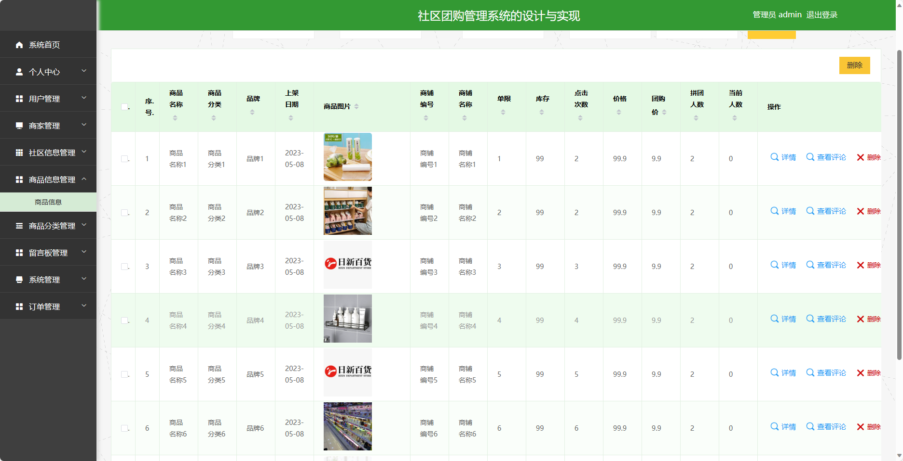

## 基于SpringBoot的社区团购管理系统

###  获取sql数据库文件: 从戎源码网 (https://armycodes.com/) QQ: 386869957 QQ群: 377586148
###  所有系统地址: (https://github.com/YuLin-Coder/AllProjectCatalog) 
###  所有项目以及源代码本人均调试运行无问题 可支持远程安装部署调试、定制修改、代码讲解

## 项目介绍
基于SpringBoot的社区团购管理系统，系统包含两种角色：管理员、用户,系统分为前台和后台两大模块，主要功能如下。

### 【管理员】:
- 个人中心：管理员可以管理个人信息，修改密码等。
- 用户管理：管理员可以管理系统的用户账号信息，包括添加、编辑、删除等操作。
- 商家管理：管理员可以管理系统的商家账号信息，包括添加、编辑、删除等操作。
- 社区信息管理：管理员可以管理系统的社区信息，包括添加、编辑、删除等操作。
- 商品信息管理：管理员可以管理系统的商品信息，包括添加、编辑、删除等操作。
- 商品分类管理：管理员可以管理系统的商品分类信息，包括添加、编辑、删除等操作。
- 留言板管理：管理员可以管理留言板上的评论、问题等，包括审核、删除等操作。
- 系统管理：管理员可以管理系统的一些通用配置，例如系统参数设置、广告轮播图等。
- 订单管理：管理员可以管理用户的订单信息，包括查看、处理、取消订单等操作。

### 【商家角色】:
- 个人中心：商家可以管理个人信息，修改密码等。
- 商品信息管理：商家可以管理自己的商品信息，包括添加、编辑、删除等操作。
- 订单管理：商家可以管理自己的订单信息，包括查看、处理、取消订单等操作。

### 【前台】:
- 首页：展示系统的概览信息。
- 商品信息：展示各类商品的详细信息。
- 活动公告：展示系统发布的团购活动信息。
- 留言板：用户可以在留言板上发表评论、提问。
- 购物车：用户可以将感兴趣的商品加入购物车。
- 个人中心：用户可以登录后进入个人中心，管理个人信息、查看订单记录等。

## 项目技术
- 编程语言：Java
- 数据库：MySQL
- 项目管理工具：Maven
- 前端技术：HTML、CSS、JavaScript、Jquery、Vue
- 后端技术：Spring、SpringMVC、MyBatis

## 运行环境
- JDK版本：JDK1.8及以上
- 开发工具：IDEA、Ecplise、Myecplise都可以
- 数据库: MySQL5.7及以上
- Maven：maven3.0及以上
- Node：14.14.0及以上

## 运行截图

